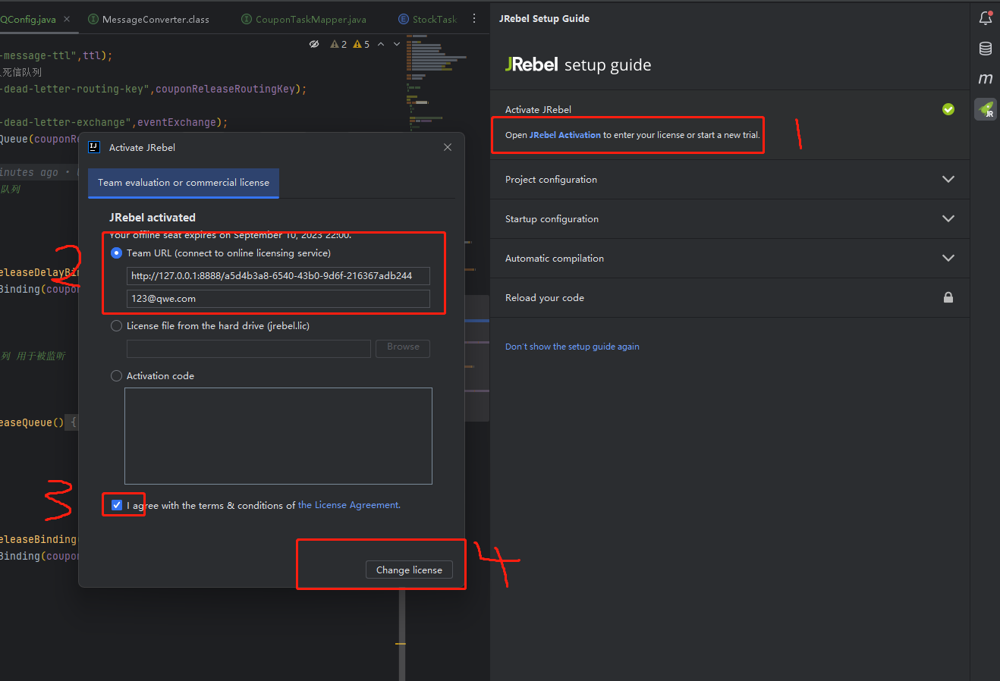
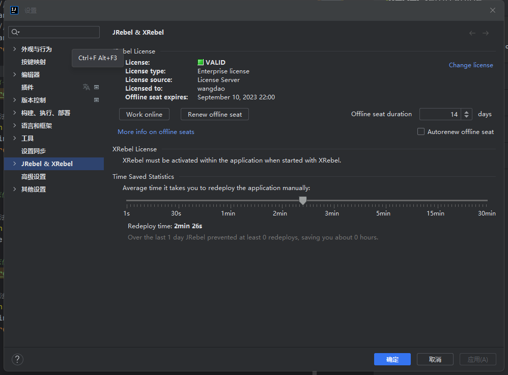

## idea 激活 JRebel
```text?linenums
插件总安装 JRebel
```
## 安装完成

## 运行本地服务程序


## 填入Team URL时，填入以下内容
```text?linenums
http://127.0.0.1:8888/{GUID}

GUID可以使用在线GUID地址在线生成，然后替换{GUID}就行。
下面邮箱地址可随便输入。
选择我同意
提交

```




## 改为离线模式
