# 接口示例
## 登录
http://124.71.168.168:8096/BM/Api/Account/Login

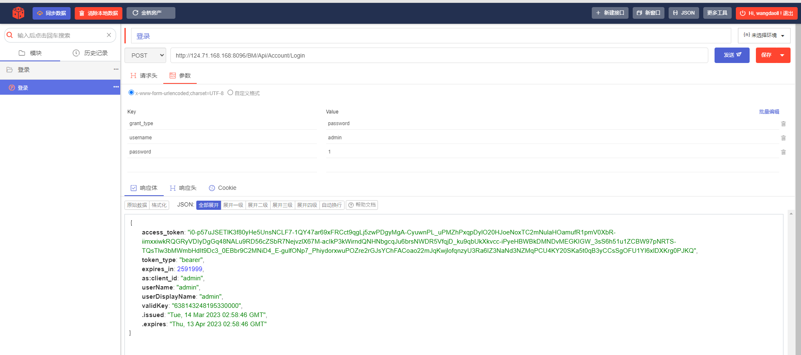
## 修改房产
http://124.71.168.168:8096/BM/api/sync/SubBuildingAsset
### 原始数据

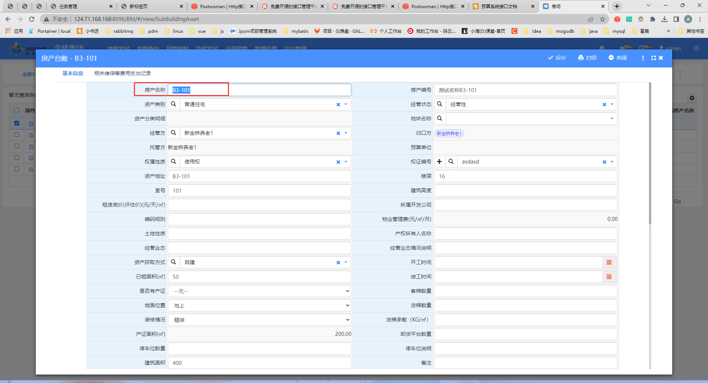
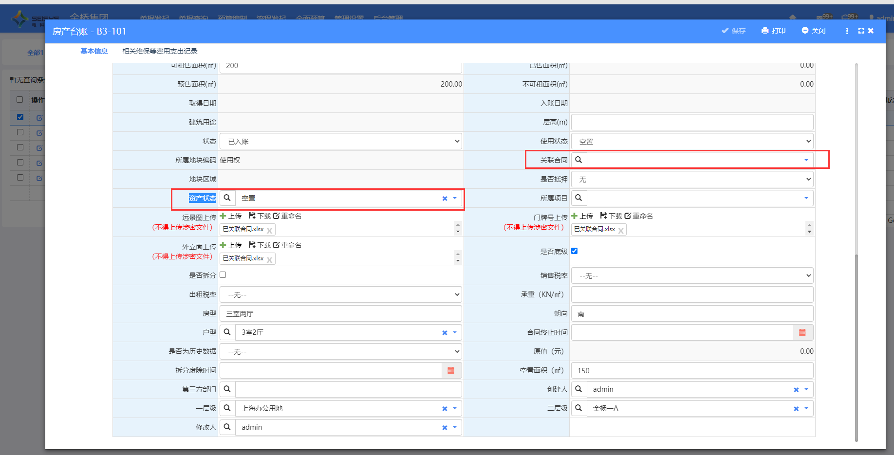


### 接口的调用成功
#### 请求参数
```json?linenums
{

"subAssetNo":"测试名称B3-101",
"subAssetName":"B3-101-修改",
"usageState":{ "code":"已出租",name:"已出租" },
"rentAlreadySpace":12.5,
"contract":{ "contractName":"金顶","contractNumber":"JQ2023012" }
}

```
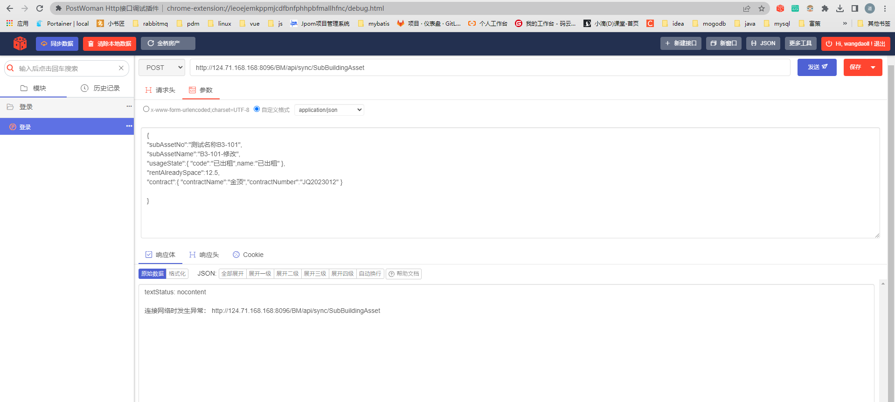

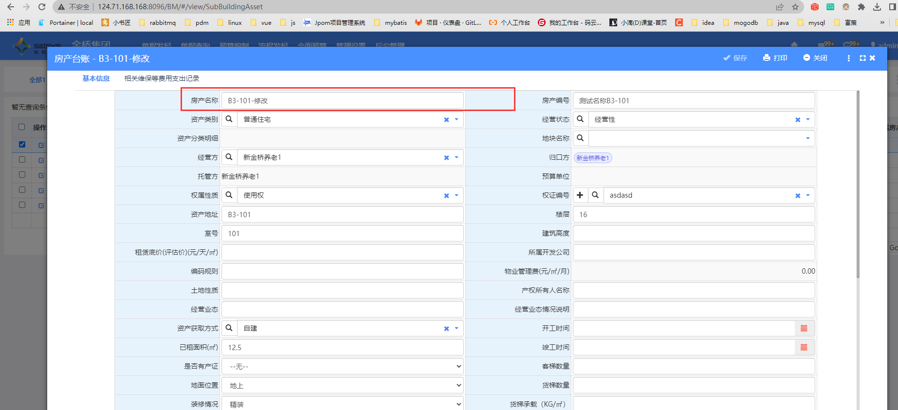
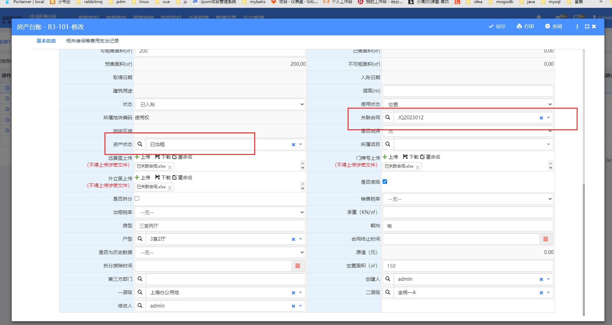

## 合同新增
### 接口 
http://124.71.168.168:8096/BM/api/sync/RevenueContract

### 请求参数
```json?linenums
{
     "corp": {
          "code": "01.11",
          "name": "上海新亚之光酒店管理有限公司"
     },
     "customer": {
          "name": "上海顶航酒店管理有限公司",
          "code": "01.04.03.05"
     },
     "actualRentalArea": "100",
     "contractBeginTime": "2023-3-14",
     "contractEndTime": "2025-3-14",
     "contractName": "测试新增",
     "contractNumber": "JQYJ2020031401",
     "contractType": {
          "code": "租赁合同",
          "name": "代理经租合同"
     },
     "contractMoney": 12.5,
     "value12": 10.5,
     "field07": "0",
     "status": 0,
     "contractAssets": [
          {
               "rowUId": "36a49c68-6c1e-4da5-bd23-aff9ef775949",
               "room": "101",
               "contractRentalArea": 200,
               "buildingAsset": {
                    "buildingNo": "金杨一A"
               },
               "subBuildingAsset": {
                    "subAssetNo": "测试名称B3-101",
                    "subAssetName": "B3-101"
               },
               "status": 0
          }
     ],
     "contractLeaseItems": [
          {
               "rowUid": "c50f16d4-928a-4b85-af99-5cff354c4ed6",
               "text01": "1",
               "text05": {
                    "code": "LGFZJ-05.01",
                    "name": "智城人才公寓"
               },
               "IsCollection": false,
               "leaseBeginTime": "2022-11-15",
               "leaseEndTime": "2023-01-14",
               "chargingFrequency": 6,
               "rentalPrice": 1000,
               "taxRate": 0.03,
               "subBuildingAssetList": [
                    {
                         "subAssetNo": "测试名称B3-101",
                         "subAssetName": "B3-101"
                    }
               ]
          }
     ],
     "contractPlans": [
          {
               "rowUid": "c50f16d4-928a-4b85-af99-5cff354c4ed6",
               "text01": {
                    "name": "租金",
                    "code": "租金"
               },
               "payTime": "2022-09-10T00:00:00+08:00",
               "payMoney": 22600,
               "cashierMoney": 22600,
               "InvoiceMoney": 0,
               "payingMoney": 22600,
               "totalMoney": 200,
               "value02": 200,
               "collectionBeginDate": "2022-09-15T00:00:00+08:00",
               "collectionEndDate": "2022-11-14T00:00:00+08:00",
               "isTerminationPay": false,
               "taxRate": 0.05,
               "dT5": "2022-08-30T00:00:00+08:00",
               "rowNumber": 1
          }
     ]
}
```

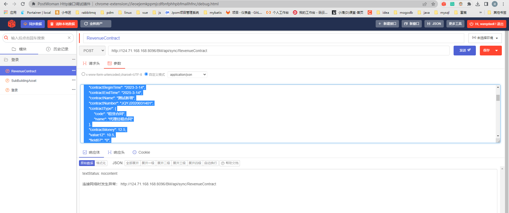
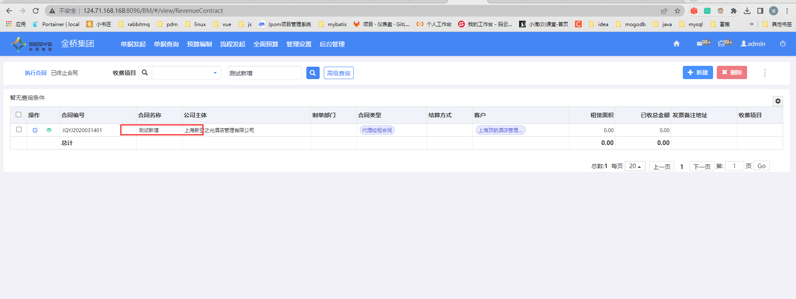

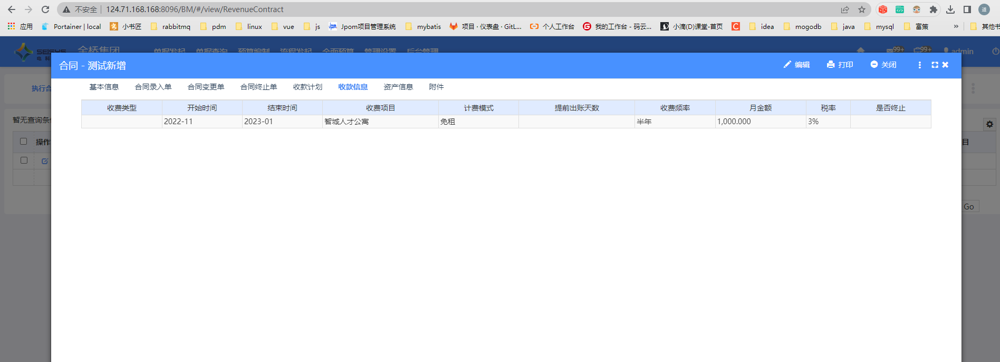
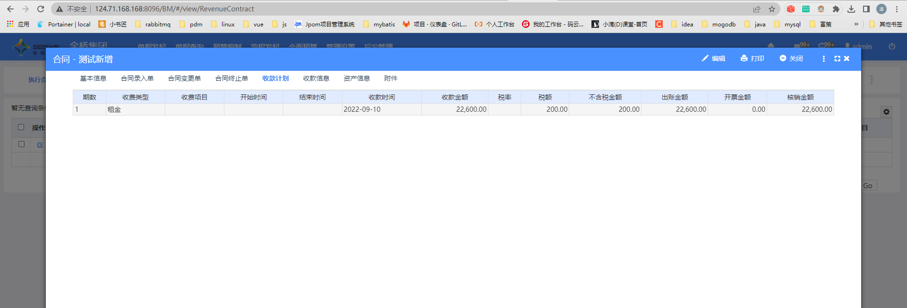

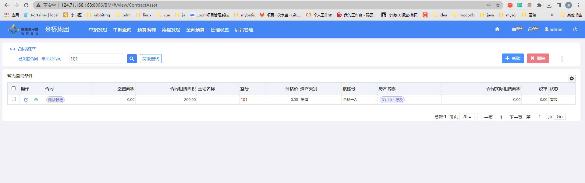 
## 合同变更
### 收款计划删除
#### 接口
```text?linenums
http://124.71.168.168:8096/BM/api/sync/RevenueContract
```
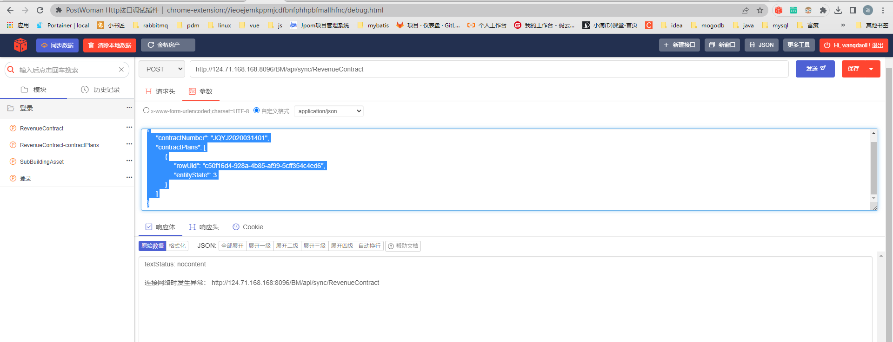
#### 请求参数
```json?linenums
{
     "contractNumber": "JQYJ2020031401",
     "contractPlans": [
          {
               "rowUid": "c50f16d4-928a-4b85-af99-5cff354c4ed6",
               "entityState": 3
          }
     ]
}
```
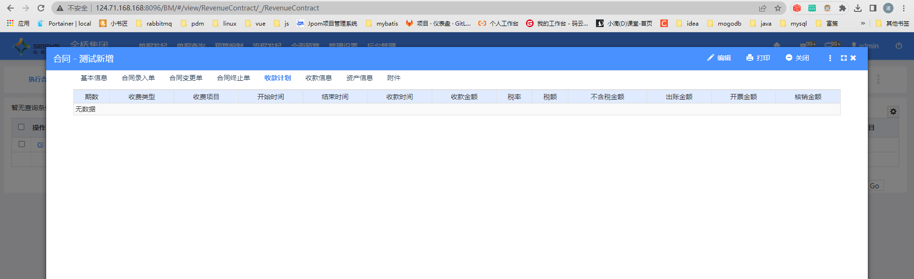


### 合同执行完毕
#### 请求接口
```text?linenums
http://124.71.168.168:8096/BM/api/sync/RevenueContract
```

#### 参数
```json?linenums
{
     "contractNumber": "JQYJ2020031401",
      "status":256
}
```

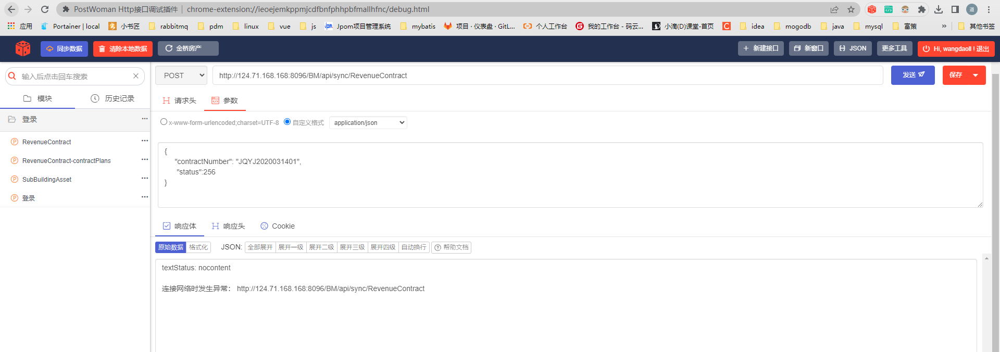
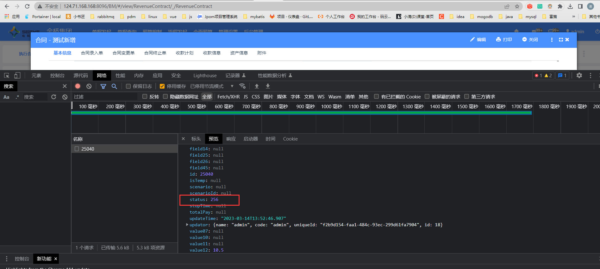


### 合同作废

#### 请求接口
```text?linenums
```
#### 请求参数

```json?linenums

```
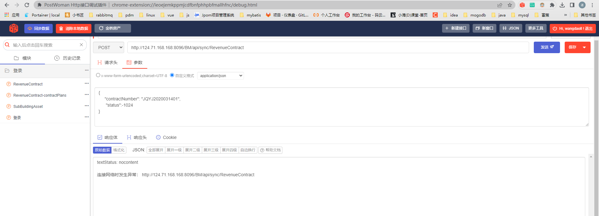

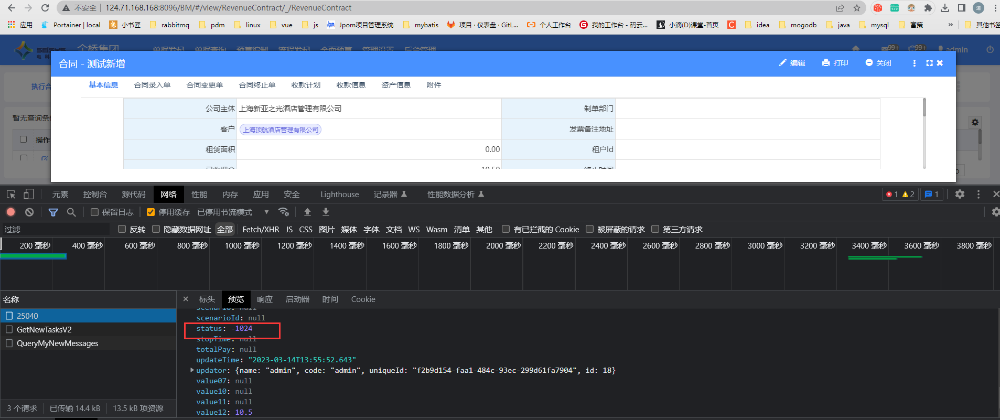

## 客户新增
#### 请求接口
```tex?linenums
http://124.71.168.168:8096/BM/api/sync/Customer
```
### 请求参数
```json?linenums
{
  "name": "测试xxxxx12312312",
  "code": "1231254143625487",
  "category": {
    "name": "自然人",
    "code":"persion"  
	}
}
```
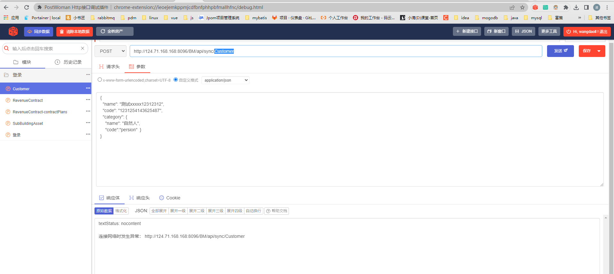

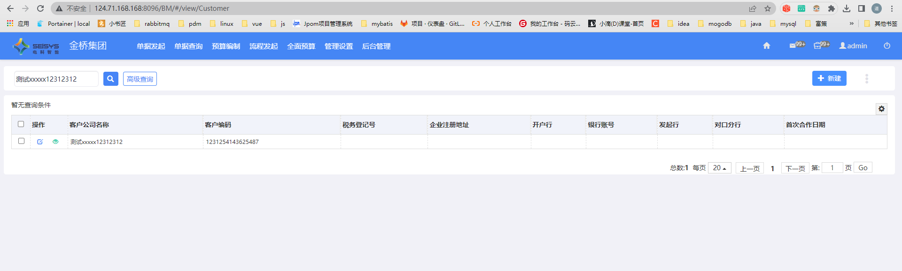