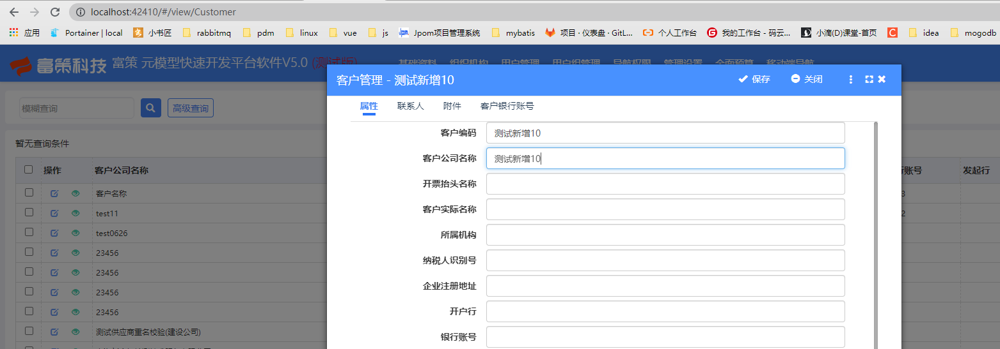
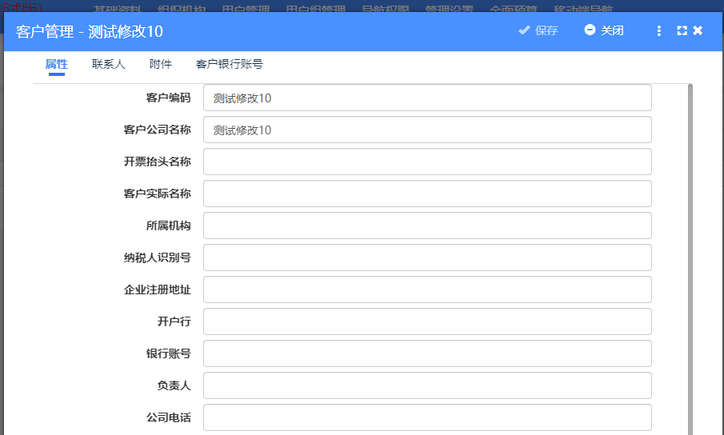

# 企业 Customer
## 配置
```tex?linenums
<Handler Type="FuceFP.JQYJ.EntityCustomHttpPublishHandler,FuceFP.JQYJ">
      <Setting Description="寓见系统企业【新增/修改】同步" ServiceUrl="https://sxh.w7t.cn/JQadmin">
        <Login Url="login">
          <Param>
              {"userCode":"fuce","password":"123456"}
              </Param>
        </Login>
        <OnInserted Url="insertEnterprise">
          <Field From="Id" To="fuceId" />
          <Field From="Name" To="name" />
        </OnInserted>
        <OnUpdated Url="updateEnterprise">
          <Field From="Id" To="fuceId" />
          <Field From="Name" To="name" />
        </OnUpdated>
      </Setting>
</Handler>
```
## 企业新增


### 请求地址
```text?linenums
https://sxh.w7t.cn/JQadmin/insertEnterprise
```
### 请求参数
```json?linenums
{"fuceId":7209,"name":"测试新增10"} 
```
### 响应结果
```json?linenums
{"status":200,"message":"创建成功","serviceId":null,"data":null,"count":null}
```
## 企业修改


### 请求地址
```text?linenums
https://sxh.w7t.cn/JQadmin/updateEnterprise
```
### 请求参数
```json?linenums
{"fuceId":7209,"name":"测试修改10"}
```
### 响应结果
```json?linenums
{"status":200,"message":"成功更新","serviceId":null,"data":null,"count":null}
```
# 合同录入单 RevenueTicket
## 提交 - 占用房间
### 请求地址
```text?linenums
https://sxh.w7t.cn/JQadmin/useEnterpriseRoom
```
### 请求参数
```json?linenums
{
    "enterprise":{
        "fuceId":2057,
        "name":"test11"
    },
    "fuceNo":"HTLR:202303150001",
    "roomNo":"测试名称B3-101"
}
```
### 响应结果
```json?linenums

```